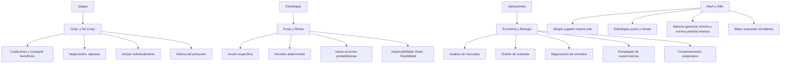

```mermaid

graph TD;
    Juegos[Juegos];
    Coop_NoCoop[Coop. y No Coop.];
    Estrategias[Estrategias];
    Puras_Mixtas[Puras y Mixtas];
    Nash_Silla[Nash y Silla];
    Aplicaciones[Aplicaciones];
    Economia_Biologia[Economía y Biología];

    Juegos --> Coop_NoCoop;
    Coop_NoCoop --> Def_Coop["Coaliciones y compartir beneficios"];
    Coop_NoCoop --> Ej_Coop["Negociación, alianzas"];
    Coop_NoCoop --> Def_NoCoop["Actúan individualmente"];
    Coop_NoCoop --> Ej_NoCoop["Dilema del prisionero"];

    Estrategias --> Puras_Mixtas;
    Puras_Mixtas --> Def_Puras["Acción específica"];
    Puras_Mixtas --> Carac_Puras["Decisión determinista"];
    Puras_Mixtas --> Def_Mixtas["Varias acciones probabilísticas"];
    Puras_Mixtas --> Vent_Mixtas["Imprevisibilidad, Nash, Flexibilidad"];

    Nash_Silla --> Def_Nash["Ningún jugador mejora solo"];
    Nash_Silla --> Apli_Nash["Estrategias puras y mixtas"];
    Nash_Silla --> Def_Silla["Máxima ganancia mínima y mínima pérdida máxima"];
    Nash_Silla --> Carac_Silla["Mejor respuesta simultánea"];

    Aplicaciones --> Economia_Biologia;
    Economia_Biologia --> Mercados["Análisis de mercados"];
    Economia_Biologia --> Subastas["Diseño de subastas"];
    Economia_Biologia --> Contratos["Negociación de contratos"];
    Economia_Biologia --> Supervivencia["Estrategias de supervivencia"];
    Economia_Biologia --> Cooperacion["Comportamiento cooperativo"];

```
